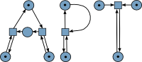

APT – Analysis of Petri nets and labeled transition systems
===========================================================

Welcome to APT. The purpose of this software is to run various analysis methods
on Petri nets and labeled transition systems. This guide explains the most
important aspects for getting started with APT.

For citing APT, we recommend the following publications:
* General: [Eike Best, Uli Schlachter: Analysis of Petri Nets and Transition
  Systems](http://dx.doi.org/10.4204/EPTCS.189.6). In [ICE
  2015](http://dx.doi.org/10.4204/EPTCS.189): 53-67
* Synthesis: [Uli Schlachter: Petri Net Synthesis for Restricted Classes of
  Nets](http://dx.doi.org/10.1007/978-3-319-39086-4_6). In [Petri Nets
  2016](http://dx.doi.org/10.1007/978-3-319-39086-4): 79-97

Further reading
---------------

* [Obtaining APT](doc/obtaining.md)
* [Guide for using APT](doc/using.md)
* [JSON-interface for APT](doc/json.md)
* [The file format](doc/file_format.md)
* [Extending APT with own modules](doc/extending.md)
* [Javadoc API documentation](http://CvO-theory.github.io/apt-javadoc/)
* [A Graphical user interface for APT](https://github.com/CvO-Theory/apt-gui)

Short guide for using APT
-------------------------

APT is a command line application. If you start it without any further
arguments, it provides a list of available modules:

    $ java -jar apt.jar
    Usage: apt <module> <arguments>

    Petri net
    =========
      bcf                          Check if a Petri net is behaviourally conflict free (BCF)
      bicf                         Check if a Petri net is binary conflict free (BiCF)
      bounded                      Check if a Petri net is bounded or k-bounded
      coverability_graph           Compute a Petri net's coverability graph
    [...]

If you provide the name of a module, you get information about how that module
is to be called:

    $ java -jar apt.jar bounded
    Too few arguments

    Usage: apt bounded <pn> [<k>]
      pn         The Petri net that should be examined
      k          If given, k-boundedness is checked

    Check if a Petri net is bounded or k-bounded. A Petri net is bounded if there
    is an upper limit for the number of token on each place. It is k-bounded if
    this limit isn't bigger than k.

This module can be used as follows:

    $ java -jar apt.jar  bounded nets/eb-nets/basic/pn3-net.apt
    bounded: No
    witness_place: s2
    witness_firing_sequence: "a;b"

The [guide for using APT](doc/using.md) provides more explanations and examples.

Providing feedback
------------------

More information about APT can be found on our homepage:

http://pg-apt.informatik.uni-oldenburg.de/

This project is supervised by the ParSys group at Oldenburg University:

http://www.uni-oldenburg.de/informatik/parsys/

http://www.uni-oldenburg.de/informatik/parsys/projekte/

If you have any problems when using this software, if you think that you found a
bug or if you want to suggest improvements, don't hesitate to contact us. You
can reach us under the following mail address:

pg-apt-info@informatik.uni-oldenburg.de

We want to thank you for any feedback that you will provide.
