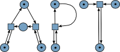

APT – Analysis of Petri nets and labeled transition systems
===========================================================

Welcome to APT. The purpose of this software is to run various analysis methods
on Petri nets and labeled transition systems. This guide explains the most
important aspects for getting started with APT.

Table of contents
-----------------

* Building APT
* Short guide for using APT
* The file format
* Providing feedback

Building APT
------------

A pre-build "apt.jar" files is available
[here](http://cvo-theory.github.io/apt-javadoc/apt.jar).

This software is written in the [Java programming language](http://java.com).
Thus it should work on various architectures and operating systems. For building
APT, a Java Development Kit (JDK) compatible with Java 7 and [Apache
Ant](http://ant.apache.org) is required. The configuration for Ant is contained
in a file called "build.xml". The way that Ant is called varies depending on the
operating system and integrated development environment used.  This guide
explains how a JAR file can be built on Unix-like systems.  Please refer to the
relevant online documentation for other systems.

Building and using a JAR file on the command line of Unix-like systems:

Just call "ant jar" in the directory containing "build.xml". This will build a
file called "apt.jar". You can run this file via "java -jar apt.jar".

If Ant complains "javac: invalid target release: 1.7", you are not using a
Java 7 JDK. Please update your Java installation.

Short guide for using APT
-------------------------

The various analysis methods that APT contains are implemented as modules. So
first we have to figure out which modules are available. To do this, we start
the JAR file without any extra arguments. On Unix-like systems this is done via
"java -jar apt.jar":

    $ java -jar apt.jar
    Usage: apt <module> <arguments>

    Petri net
    =========
      bcf                          Check if a Petri net is behaviourally conflict free (BCF)
      bicf                         Check if a Petri net is binary conflict free (BiCF)
      bounded                      Check if a Petri net is bounded or k-bounded
      coverability_graph           Compute a Petri net's coverability graph
    [...]

Let's assume we want to check if a Petri net is bounded. But what arguments do
we have to provide? Let's figure out!

    $ java -jar apt.jar bounded
    Too few arguments

    Usage: apt bounded <pn> [<k>]
      pn         The Petri net that should be examined
      k          If given, k-boundedness is checked

    Check if a Petri net is bounded or k-bounded. A Petri net is bounded if there
    is an upper limit for the number of token on each place. It is k-bounded if
    this limit isn't bigger than k.

OK, so the bounded-module wants a Petri net as its argument. Petri nets are read
from files. The file format used will be explained below. A sample file that
comes bundled with this software is "nets/eb-nets/basic/pn3-net.apt":

    $ java -jar apt.jar  bounded nets/eb-nets/basic/pn3-net.apt
    bounded: No
    witness_place: s2
    witness_firing_sequence: "a;b"

This tells us that at least the place "s1" is unbounded and thus the net as a
whole is unbounded, too.

Next we want to compute a coverability graph. The "coverability_graph" module
does that for us. However, the name is quite long and we are lazy. For this
reason, we can shorten the name, as long as the result still uniquely identifies
a module. This means the following will work:

    $ java -jar apt.jar coverab nets/eb-nets/basic/pn3-net.apt
    [long output here]

The command prints the resulting LTS in the file format. That doesn't help us
much. So what can we do about this? Let's go a step back and look at the
description for the "coverability_graph" module:

    $ java -jar apt.jar coverab
    Too few arguments
    Usage: apt coverability_graph <pn> [<lts>]
      pn         The Petri net that should be examined
      lts        Optional file name for writing the output to

    Compute a Petri net's coverability graph

Aha! This module has an optional argument. This is an output argument: The
resulting LTS will be written to this file. Let's try this:

    $ java -jar apt.jar coverab nets/eb-nets/basic/pn3-net.apt lts-for-pn3-net.apt
    reachability_graph: No

The output becomes much shorter now. Also, the module tells us that the
resulting coverability graph is not a reachability graph. We already know this,
because the net is unbounded, but it is nice to know that the net didn't
suddenly become bounded. :-)

There are also other kinds of optional arguments:

    $ java -jar apt.jar weakly_live
    Too few arguments
    Usage: apt weakly_live <pn> [<transition>]
      pn         The Petri net that should be examined
      transition A transition that should be checked for liveness

    Test if a Petri net or a transition (if given) is weakly live. A transition is
    weakly live if an infinite fire sequence exists which fires this transition
    infinitely often. A Petri net is weakly live when all of its transitions are
    weakly live.

This module has an optional transition argument. We can see that it is optional,
because it is written in square brackets. This means we can either call it
without any argument for testing if the Petri net is weakly live or we can call
it with a transition to check if that transition is weakly live.

So, is the net weakly live?

    $ java -jar apt.jar weakly_live nets/eb-nets/basic/pn1b-net.apt
    weakly_live: No
    sample_counterexample_transition: t2

Nope, it isn't. What about just some specific transition. Let's check t1.

    $ java -jar apt.jar weakly_live nets/eb-nets/basic/pn1b-net.apt t1
    weakly_live: Yes

Since APT was created with scriptability in mind it can be integrated
in other programs. For example, APT calls can be connected via pipes
in most UNIX-like operating systems that provide bash or similar
shells.

Instead of generating intermediate files like in the following
example whichs draws the coverability graph of Petri net

    $ java -jar apt.jar coverab nets/eb-nets/basic/pn1b-net.apt coverability.apt
    reachability_graph: Yes
    $ java -jar apt.jar draw coverability.apt coverability.dot

we can combine both these calls to APT and thus avoid generating the
intermediate file "coverability.apt". In order to do this we redirect the
file output of the coverability graph module directly to the file
input of the draw module:

    $ java -jar apt.jar coverab nets/eb-nets/basic/pn1b-net.apt - | java -jar apt.jar draw - coverability.dot

The drawn coverability graph is directly written to the file
"coverability.dot" without creating an intermediate file for the
coverability graph in the APT file format.

The "-" tells APT to use the standard input or standard output when
files are either read from or written to a file.

Another way to integrate APT in other programs is to use its return
value. Among other use cases this can be used to create your own
output that is shown to the user like in the following example:

    if apt bounded nets/eb-nets/basic/pn1b-net.apt > /dev/null; then
      echo "The Petri net is bounded"
    else;
      echo "The Petri net is not bounded"
    fi;

Instead of showing the user the usual output from APT (which in this
case is directed to /dev/null/ to hide it from the user) the user
is presented with the phrase "The Petri net is bounded" if the Petri
net is indeed bounded or "The Petri net is not bounded" otherwise.

There are two modules which use external programs. These are the "use-synet" and
"use-petrify" modules.  If you want to use these modules, you need to make sure
that your PATH variable contains the directory where those programs are located.

Please note that there is now a "synthesize" module which offers all the
possibilities of "use-synet" and "use-petrify" and can even do more.

Synet and Petrify can be downloaded here:

http://www.irisa.fr/s4/tools/synet/

http://www.lsi.upc.edu/~jordicf/petrify/

The file format
---------------

The APT tool works with Petri nets and labeled transition systems. Obviously,
all of these are finite, because describing infinite objects in files can be a
little hard. :-)

Our Petri nets are place/transition nets with arbitrary (non-negative!) arc
weight and an initial marking. Transitions can be given a label which is used
for describing a language. If a transition is not explicitly labeled, it gets
its unique identifier as a label. "Silent transitions", that is transitions
which don't generate any symbol when fired, are not supported.

Labeled transition systems consist of states and arcs between states. One of the
states is the system's initial state. Arcs get a label, too.

The actual file format consists of multiple sections. For labeled transition
systems, the file first describes the states and transitions and then the arcs
between the states. For this, the source node, transition and target node of an
arc are listed in a single line.

Petri nets also begin with a list of places and transitions. Then, for each
transition the flows are described. These are the preset and postset of the
transition. These sets are multiset and thus can contain an entry more than
once.

Altogether, the file formats are, hopefully, simple and easy to read. Just look
at some of the sample files to get started! For a formal grammar and a more detailed description, take a look into APT.pdf in ./doc/. 

Of course there are also formal definitions of the properties analyzed in our
tool. Many of these can be found in the document APT.pdf in ./doc/.

Providing feedback
------------------

More information about APT can be found on our homepage:

http://pg-apt.informatik.uni-oldenburg.de/

The latest Javadoc documentation is always available at:

http://CvO-theory.github.io/apt-javadoc/

This project is supervised by the ParSys group at Oldenburg University:

http://www.uni-oldenburg.de/informatik/parsys/

http://www.uni-oldenburg.de/informatik/parsys/projekte/

If you have any problems when using this software, if you think that you found a
bug or if you want to suggest improvements, don't hesitate to contact us. You
can reach us under the following mail address:

pg-apt-info@informatik.uni-oldenburg.de

We want to thank you for any feedback that you will provide.
